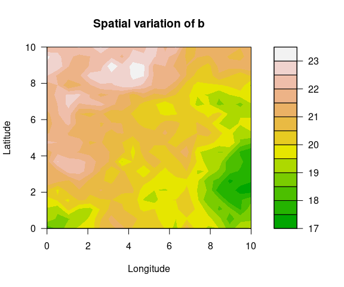

# SpatialGEV

*Meixi Chen, Martin Lysy*

---

### Description

A fast Bayesian inference method for spatial random effects modelling of weather extremes. The latent spatial variables are efficiently marginalized by a Laplace approximation using the [***TMB***](https://github.com/kaskr/adcomp) library, which leverages efficient automatic differentiation in C++. The models are compiled in C++, whereas the optimization step is carried out in R. With this package, users can fit spatial GEV models with different complexities to their dataset without having to formulate the model using C++.  This package also offers a method to sample from the approximate posterior distributions of both fixed and random effects, which will be useful for downstream analysis. 

### Installation

Before installing ***SpatialGEV***, make sure you have ***TMB*** installed following the instructions [here](https://github.com/kaskr/adcomp/wiki/Download). 

***SpatialGEV*** uses several functions from the ***INLA*** package for SPDE approximation to the Matérn covariance as well as mesh creation on the spatial domain. If the user would like to use the SPDE method (i.e. `kernel="spde"` in `spatialGEV_fit()`), please first install package ***INLA***. Since ***INLA*** is not on CRAN, it needs to be downloaded following their instruction [here](https://www.r-inla.org/download-install).

To download this package in R, run 
```r
devtools::install_github("meixichen/SpatialGEV")
```

### Model
To study spatial extremes such as extreme rainfall, snowfall, and temperature, we consider a hierarchical model with a data layer of generalized extreme value (GEV) distribution and a spatial random effects layer of Gaussian processes (GP). This model is abbreviated as the GEV-GP model. To summarize, we have `Y ~ GEV(a, b, s)` where `a`, `b`, and `s` are GEV location, scale, and shape parameters. We also have `a ~ GP(mean, kernel)`, `b ~ GP(mean, kernel)`, and `s ~ GP(mean, kernel)`, where the mean function depends on some regression coefficients `beta` and the kernel defines the spatial correlation. For more details about the model, see our [arxiv paper](https://arxiv.org/abs/2110.07051?context=stat.CO).

### Example
Using the simulated data set `simulatedData2` provided in the package, we demonstrate how to use this package. Spatial variation of the GEV parameters are plotted below.
```
# GEV parameters simulated from Gaussian random fields
a <- simulatedData2$a # location
logb <- simulatedData2$logb # log scale
logs <- simulatedData2$logs # log shape
locs <- simulatedData2$locs # coordinate matrix
n_loc <- nrow(locs) # number of locations
y <- Map(evd::rgev, n=sample(50:70, n_loc, replace=TRUE),
         loc=a, scale=exp(logb), shape=exp(logs)) # observations
```




To fit a GEV-GP model to the simulated data, use the `spatialGEV_fit()` function. We use `random="abs"` to indicate that all three GEV parameters are treated as random effects. The shape parameter `s` is constrained to be positive (log transformed) by specifying `reparam_s="positive"`. The covariance kernel function used here is the exponential kernel `kernel="exp"`. Initial parameter values are passed to `init_param` using a list.
```
fit <- spatialGEV_fit(y = y, locs = locs, random = "abs",
                      init_param = list(a = rep(60, n_loc),
                                        log_b = rep(2,n_loc),
                                        s = rep(-3,n_loc),
                                        beta_a = 60, beta_b = 2, beta_s = -2,
                                        log_sigma_a = 1.5, log_ell_a = 5,
                                        log_sigma_b = 1.5, log_ell_b = 5,
                                        log_sigma_s = -1, log_ell_s = 5),
                      reparam_s = "positive", kernel="exp", silent = T)

class(fit)
#> [1] "spatialGEVfit"
print(fit)
#> Model fitting took 205.280467748642 seconds 
#> The model has reached relative convergence 
#> The model uses a exp kernel 
#> Number of fixed effects in the model is 9 
#> Number of random effects in the model is 1200 
#> Hessian matrix is positive definite. Use spatialGEV_sample to obtain posterior samples
```

Posterior samples of the random and fixed effects are drawn using `spatialGEV_sample()`. Specify `observation=TRUE` if we would also like to draw from the posterior predictive distribution.
```
sam <- spatialGEV_sample(model = fit, n_draw = 2000, observation = T)
print(sam)
#> The samples contains 2000 draws of 1209 parameters 
#> The samples contains 2000 draws of response at 400 locations 
#> Use summary() to obtain summary statistics of the samples
```

To get summary statistics of the posterior samples, use `summary()` on the sample object.
```
pos_summary <- summary(sam)
pos_summary$param_summary[1:5,]
#>                   2.5%        25%        50%        75%      97.5%       mean
#> a1          59.2556574 60.0367382 60.4530836 60.8875724 61.6483647 60.4615866
#> a2          59.4032730 60.1219199 60.5665952 60.9924753 61.7481593 60.5701293
#> a3          59.4014487 60.1590178 60.5622019 60.9232839 61.6675096 60.5499580
#> a4          59.3537206 60.1099659 60.4892334 60.8886191 61.5937046 60.4981138
#> a5          59.3622475 60.0573291 60.4044741 60.8010299 61.4994020 60.4277049

pos_summary$y_summary[1:5,]
#>        2.5%      25%      50%      75%    97.5%     mean
#> y1 37.59580 55.57835 68.33582 86.56240 145.6394 74.75045
#> y2 37.63764 54.37389 67.53186 83.14399 139.9202 72.23786
#> y3 37.86797 54.62510 67.85533 86.69815 147.6480 74.29521
#> y4 35.89303 54.34104 68.39809 87.60576 142.1014 73.67881
#> y5 34.91801 54.05809 68.75051 87.73555 150.1256 74.36443
```
